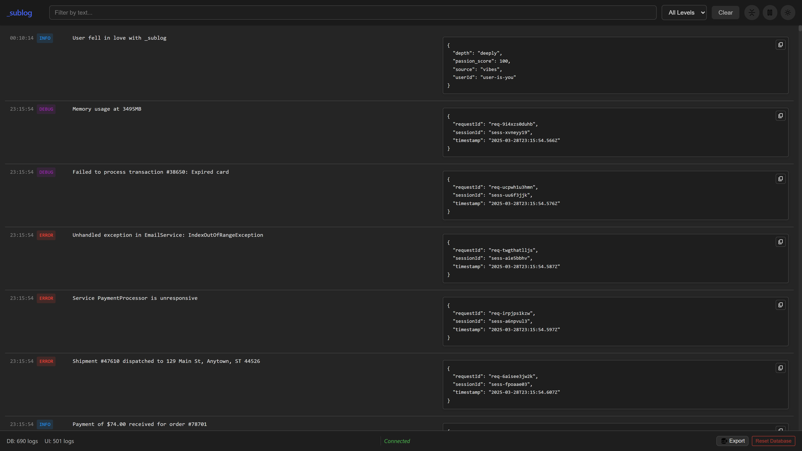

# _sublog



## Simple, Self-Hosted, Real-time Log Viewing for Developers

_sublog is a minimalist HTTP log receiver and web UI all in one super-lightweight container.

## TL;DR

1. Run the container:

    ```bash
    docker run -d \
        --name sublog \
        -p 8080:8080 \
        -v sublog_data:/data \
        --restart unless-stopped \
        jontybrook/sublog:latest
    ```

2. Send logs via HTTP POST requests to the `/logs` endpoint.

    ```bash
    curl -X POST -H "Content-Type: application/json" \
    -d '{"level": "info", "message": "User logged in successfully", "meta": {"userId": "user-123", "ip": "192.168.1.100"}}' \
    http://localhost:8080/logs
    ```

3. Open the web UI in your browser:

    > <http://localhost:8080>

4. Profit.

## Features

_sublog_ is a minimalist, self-hosted log receiver and web UI designed for developers who need immediate, real-time visibility into their application logs without the overhead of enterprise-grade solutions.

- Runs as a single Docker container.
- Send logs via HTTP POST requests to the `/logs` endpoint.
- Stores logs in SQLite on disk.
- Simple built-in web UI streams logs in real-time via WebSockets with support for filtering and searching.

Tired of wrestling with complex, heavyweight logging platforms just to get a quick view of what your application is doing _right now_?

**Sublog** is the answer. It's a minimalist, self-hosted log receiver and web UI designed for developers who need immediate, real-time visibility into their application logs without the overhead of enterprise-grade solutions.

The perfect solution for development environments, small projects, or anyone who values simplicity.

## Built with

- Back-end: Go
- Front-end: Vanilla JavaScript, HTML, and CSS.
- Database: SQLite

## Why Sublog? ✨

- **Dead Simple Setup:** Get up and running in minutes with just Docker and Docker Compose.
- **Real-time Live Stream:** Watch your logs flow into the web UI instantly via WebSockets.
- **Completely Self-Hosted:** Runs anywhere Docker does. No external services, no cloud dependencies, no vendor lock-in. Keep your logs on your machine.
- **Minimalist & Lightweight:** Built with Go, SQLite, and Vanilla JavaScript. Low resource consumption, fast performance, and a tiny footprint.
- **Winston HTTP Compatible:** Natively supports receiving logs from the popular Winston logger using its [HTTP transport](https://github.com/winstonjs/winston/blob/master/docs/transports.md#http-transport) (single and batch modes).
- **Flexible Log Format:** Accepts logs in both JSON array format `[{log1}, {log2}]` and single object format `{log}`.
- **Basic Filtering:** Quickly filter logs by level or search by text directly in the UI.
- **Zero Configuration (Almost):** Sensible defaults mean you can often just `docker compose up` and go.
- **Open Source:** Free to use, easy to inspect, and open to contributions.

---

## Getting Started 🚀

Setting up Sublog is incredibly easy:

1. **Prerequisites:** Ensure you have [Docker](https://docs.docker.com/get-docker/) and [Docker Compose](https://docs.docker.com/compose/install/) installed on your system.
2. **Clone the Repository:**

    ```bash
    git clone git@github.com:subcode-labs/sublog.git
    cd sublog
    ```

3. **Build & Run with Docker Compose:**

    ```bash
    docker compose up --build -d
    ```

    _(Use `-d` to run in detached mode)_
4. **Access the Web UI:** Open your browser and navigate to `http://localhost:8080` (or the port you configured).
5. **Start Sending Logs!** (See below)

---

## Sending Logs ➡️

Sublog listens for incoming logs via **HTTP POST** requests on the `/logs` endpoint. Logs should be sent with `Content-Type: application/json`.

Sublog accepts logs in two formats:

- As a JSON array: `[{log1}, {log2}, ...]`
- As a single JSON object: `{log}`

The expected structure for each log object is flexible but typically includes:

- `level` (string, e.g., "info", "warn", "error")
- `message` (string, the log message)
- `meta` (object, optional, containing any additional metadata)
- `timestamp` (string, optional, ISO 8601 format preferred e.g., `YYYY-MM-DDTHH:MM:SS.msZ`)

### Example using `curl`

```bash
# Sending a single log as an array (traditional format)
curl -X POST -H "Content-Type: application/json" \
 -d '[{"level": "info", "message": "User logged in successfully", "meta": {"userId": "user-123", "ip": "192.168.1.100"}}]' \
 http://localhost:8080/logs

# Sending a single log as a JSON object (new simplified format)
curl -X POST -H "Content-Type: application/json" \
 -d '{"level": "info", "message": "User logged in successfully", "meta": {"userId": "user-123", "ip": "192.168.1.100"}}' \
 http://localhost:8080/logs

# Sending a batch of logs
curl -X POST -H "Content-Type: application/json" \
 -d '[
       {"level": "debug", "message": "Processing request data", "meta": {"requestId": "abc-xyz"}},
       {"level": "warn", "message": "Rate limit approaching for user", "meta": {"userId": "user-456", "limit": 100, "current": 95}},
       {"level": "error", "message": "Database connection failed", "meta": {"dbHost": "[db.example.com](https://www.google.com/search?q=db.example.com)", "errorCode": 5003}}
     ]' \
 http://localhost:8080/logs
```

---

## License

[Apache 2.0](LICENSE)
